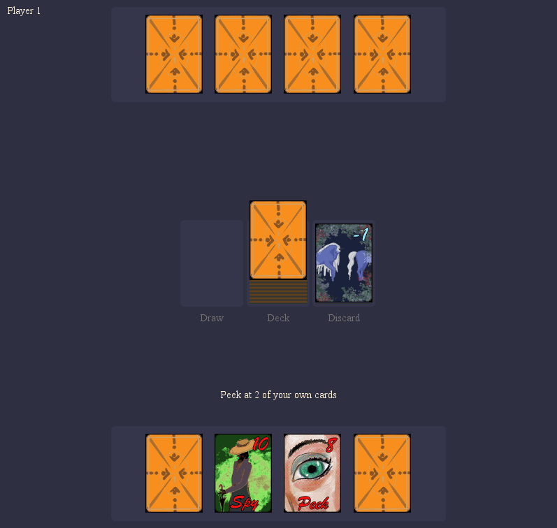
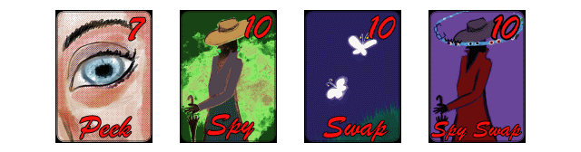

# Cabo Card Game

GUI program for playing a variant of the [Cabo](https://en.wikipedia.org/wiki/Cabo_(game)) card game. Cabo is an information management game in which players compete to gather accurate information. This program specifically plays a German variant of Cabo.

  

This program was made for a 2-week assignment in Object Oriented Programming, so it was a collaborative project with [my lab partner](https://github.com/janaheit). We also had help from Olga Wazny, who designed all of the card textures.

## Requirements

[Java](https://www.java.com/en/download/) version 1.8 or higher.

## How to run

[Download]() `cabo.jar`, then run `$ java -jar cabo.jar`.

## Licence

This program and all of its source code are in the public domain, you can use them for anything you want. The card textures have a proprietary licence - you cannot use those in your own projects without permission from the author.

## Game Rules

Cabo is an information management game in which players compete to gather accurate information. This particular version of Cabo is a German variation with slightly altered rules.

#### Start
---------

Each game starts by dealing 4 cards *face down* to to each player, and 1 card *face up* to the discard pile. At the end of each game, the player whose cards have the *lowest* sum value wins - so each player is looking to discard cards when possible, and to keep only low valued cards.

After the initial cards have been dealt, the players take turns peeking at any 2 of their cards. The cards are peeked in secret, so opponents cannot see the cards being peeked. When each player finishes peeking at 2 of their cards, the main phase of Cabo begins.

#### Main phase
---------------

In the main phase, each player starts their turn by drawing 1 card either from the deck, or from the discard pile. The drawn card is placed *face up* on the draw area. The player can then either swap the drawn card with one of their own cards, or discard the drawn card. If the player chooses to swap out one of their cards, the swapped out card is placed *face up* on top of the discard pile, and the drawn card is added to the player's hand *face-down*. The player's turn then ends.

If, instead, the player chooses to discard, the drawn card is placed *face-up* on top of the discard pile. If the discarded card has a special ability written on it, this ability is triggered and the player must use it before ending their turn - this is the only way to trigger a card's special ability. If the discarded card does *not* have a special ability, the player's turn immediately ends.

#### Card dropping
------------------

Additionally, at *any* point during a player's turn the player may try to discard one of the cards from their hand, or from any of their opponent's hands - this is called card *dropping*. If the card that was dropped is *the same* as the card on top of the discard pile, then the drop is successful, and the card stays in the discard pile. If a player successfully drops an opponent's card, they may then transfer one of their cards card over to their opponent, placing it *face down* in the opponent's hand without either player looking at the card. If the player makes a mistake during a card drop, and the dropped card is not the same as the card on top of the discard pile, the dropped card stays in the player's hand, and the player must draw one additional card from the deck *face-down*.

#### Calling Cabo!
------------------

At the start of any player's turn, before they have drawn any cards, they may instead choose to call Cabo! When a player does this, their turn ends immediately. All other players get 1 additional turn to play, during which they may not call Cabo again, and the game then ends. After the last turn is played, the sum value of all player cards is calculated, and the winner is declared.

#### Card special effects
-------------------------

  

Special abilities are printed in red writting on the cards that have them. The abilities are as follows:

|                  |             |
|:----------------:|:----------- |
| **Peek**         | Peek at 1 card from your hand in secret. |
| **Spy**          | Peek at 1 card from any opponent's hand in secret. |
| **Swap**         | Swap one of your cards with one of your opponent's cards. The player can also choose to skip this ability. |
| **Spy and Swap** | Peek at 1 card from your hand, and 1 card from any opponent's hand, both in secret. Then, swap the peeked cards. The player may also choose to skip the swap part of this ability. |

## Limitations

- AI players are not in the game so it can only be played in multi-player mode, with players taking turns sitting at the computer. The reason we decided against making some simple AI is that there would be no way to properly communicate to the player what the AI did during it's turn since there are no animations in the game right now. All turns would be instant and it would be extremely disorganizing playing against an AI that could insert cards into parts of your deck without you even knowing. We would need to add a card animation system first before adding in an AI.
- Even though any player is technically supposed to be able to drop any other players card, even when it isn't their turn - we couldn't figure out any way that that could be implemented and this seems to be a limitation with using only 1 computer for the input of 2+ players. If during player 1's turn, player 2 decides to take the computer and drop one of player 1's cards, there is no way we can distinguish this from the situation where player 1 drops one of his own cards.
- Even though Cabo is originally designed for 2-4 players, support 2 player, 1v1 mode due to time constraints.
